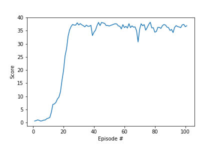

# Continuous-Control
### Summary
For this project, an agent, a double-jointed arm was trained to maintain its position at the target location for as many time steps as possible.

A reward of +0.1 is provided for each step that the agent's hand is in the goal location. The goal was to get an average score of +30 over 100 consecutive episodes.

The observation space consists of 33 variables corresponding to position, rotation, velocity, and angular velocities of the arm. Each action is a vector with four numbers, corresponding to torque applicable to two joints where each element of the vector is between -1 and 1. The results are for environment version two with twenty agents.

Install the following packages using pip:
```
tensorflow==1.7.1
Pillow>=4.2.1
matplotlib
numpy>=1.11.0
jupyter==1.0.0
pytest>=3.2.2
docopt==0.6.2
pyyaml
protobuf==3.5.2
grpcio==1.11.0
torch==0.4.0
pandas==0.23.1
scipy==1.2.0
ipykernel==4.10.0
```
Then download the environment from one of the following links:

Linux: [click here](https://s3-us-west-1.amazonaws.com/udacity-drlnd/P2/Reacher/Reacher_Linux.zip)
    
Mac OSX: [click here](https://s3-us-west-1.amazonaws.com/udacity-drlnd/P2/Reacher/Reacher.app.zip)
    
Windows (32-bit): [click here](https://s3-us-west-1.amazonaws.com/udacity-drlnd/P2/Reacher/Reacher_Windows_x86.zip)
    
Windows (64-bit): [click here](https://s3-us-west-1.amazonaws.com/udacity-drlnd/P2/Reacher/Reacher_Windows_x86_64.zip)

Then run second cell to import the necessary packages, third cell to create an agent and an environment, fourth cell to train the agent and fifth cell to test the agent.

### Implementation
The agent is initialised with state size and action size in agent.py. The neural networks architecture used by the agent can be found in model.py. The goal is to estimate the optimal policy that maximizes the average cumulative rewards. Deep deterministic policy gradient algorithm is used as it can handle continuous action space. The agent uses a target and a local neural network for both actor and critic.

The actor neural network consists of one hidden layers with 256 nodes. The hidden layer has a ReLU activation function and the output layer is followed by a tanh function. The neural network takes a state as an input and outputs an action-value function for corresponding state.

The critic neural network consists of three hidden layers with 256 + action_size, 256 and 128 nodes respectively. All hidden layers have a ReLU activation function. The neural network takes state and action from buffer as an input and outputs based on action-value function calculated by the actor.

### Training
Agent takes a state as an input and outputs an action for this state. Then agent takes the next step, saves the observed experience in replay memory and once the agent has enough samples available in memory, it gets a random subset and starts to learn from that batch.

The agent solved the environment in 101 episodes and the score after each episode can be seen below.



### Parameters used to achieve this result:
| parameter | value |
| --- | --- |
| BUFFER_SIZE | 100000 |
| BATCH_SIZE | 128 |
| GAMMA | 0.99 |
| TAU | 0.001 |
| LR_ACTOR | 0.001 |
| LR_CRITIC | 0.001 |
| WEIGHT_DECAY | 0 |

Buffer size is the size of replay buffer while batch size is the size of sampled minibatch of replay buffer. &gamma; is discount factor in Bellman equation. &tau; is for soft update of target parameters. Weight decay is a factor for $L_{2}$ regularization used in training the actor or critic function approximator. The model weights of the successful agent can be found in checkpoint_actor.pth and checkpoint_critic.pth saved.

### Ideas for future work
Optuna framework can be used to tune hyperparameters. Other actor-critic method such as A3C might yield better result.